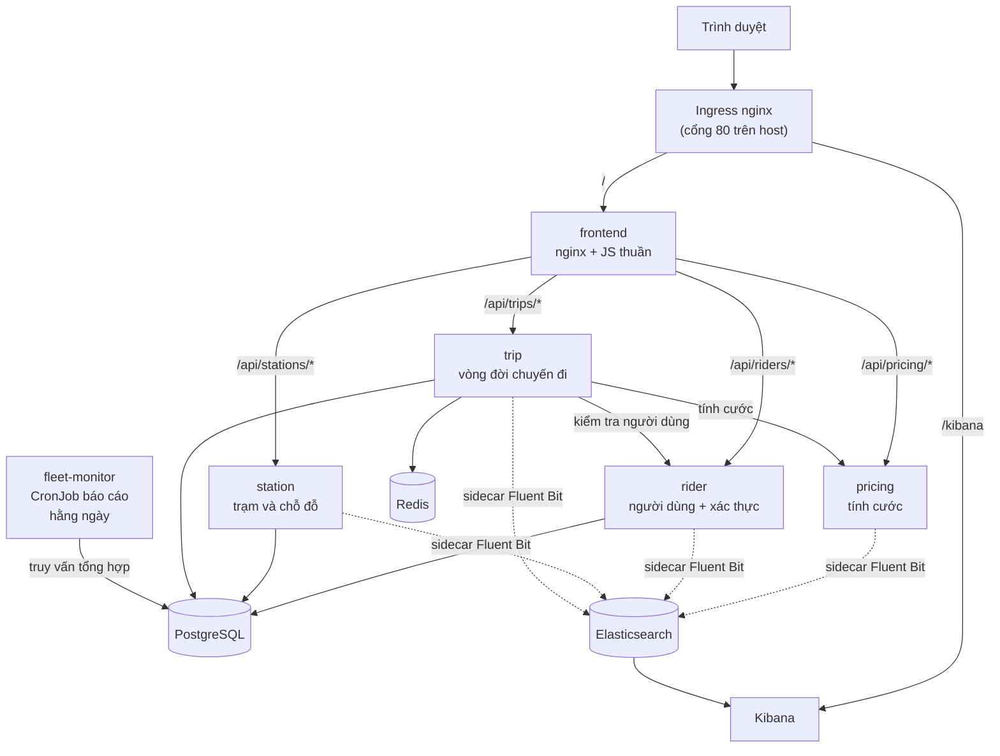

# VeloShare — Nền tảng chia sẻ xe đạp công cộng

Hệ thống chia sẻ xe đạp cho thành phố, xây dựng theo kiến trúc **microservices** và triển khai
hoàn toàn bằng **Kubernetes + Helm**. Người dùng mượn xe tại một trạm, đạp xe, trả xe và được
tính cước theo thời gian sử dụng cùng hạng thành viên.

> **Đây là dự án thực hành để học Kubernetes/Helm, không phải hệ thống production.**
> Toàn bộ quy ước phát triển nằm trong [`CLAUDE.md`](./CLAUDE.md) — hãy đọc trước khi thêm code,
> manifest hay chart.

---

## Mục lục

- [Tính năng chính](#tính-năng-chính)
- [Kiến trúc tổng quan](#kiến-trúc-tổng-quan)
- [Các thành phần hệ thống](#các-thành-phần-hệ-thống)
- [Tầng dữ liệu](#tầng-dữ-liệu)
- [Xác thực và phân quyền](#xác-thực-và-phân-quyền)
- [Quản lý secret](#quản-lý-secret)
- [Log tập trung (EFK)](#log-tập-trung-efk)
- [Báo cáo chỉ số cho quản lý](#báo-cáo-chỉ-số-cho-quản-lý)
- [Hạ tầng cluster](#hạ-tầng-cluster)
- [Cấu trúc thư mục](#cấu-trúc-thư-mục)
- [Yêu cầu công cụ](#yêu-cầu-công-cụ)
- [Bắt đầu nhanh](#bắt-đầu-nhanh)
- [Truy cập hệ thống](#truy-cập-hệ-thống)
- [Bảng giá cước](#bảng-giá-cước)
- [Danh sách API](#danh-sách-api)
- [Cấu hình](#cấu-hình)
- [Các lệnh Makefile](#các-lệnh-makefile)
- [Khắc phục sự cố](#khắc-phục-sự-cố)
- [Lưu ý bảo mật](#lưu-ý-bảo-mật)
- [Tài liệu chi tiết](#tài-liệu-chi-tiết)

---

## Tính năng chính

- **Đăng nhập bằng JWT** với hai vai trò tách biệt: `rider` (người dùng) và `admin` (quản trị).
- **Giao diện người dùng**: xem hồ sơ và hạng thành viên, duyệt danh sách trạm, bắt đầu/kết thúc
  chuyến đi của chính mình, xem lịch sử chuyến và cước phí.
- **Giao diện quản trị**: tạo/quản lý người dùng và trạm, cập nhật số chỗ trống, công cụ tính
  cước, xem toàn bộ chuyến đi của mọi người dùng.
- **Tính cước động** theo số phút, hạng thành viên và hệ số giờ cao điểm (surge).
- **Log tập trung**: mỗi pod ứng dụng có một sidecar Fluent Bit đẩy log JSON về Elasticsearch,
  tra cứu bằng Kibana. Một `request_id` duy nhất cho phép truy vết một giao dịch **xuyên nhiều
  service**.
- **Giám sát sức khoẻ**: CronJob định kỳ kiểm tra `/healthz` của các service.
- **Cluster nhiều node**: workload chạy trên các worker node, control-plane được taint để không
  nhận pod ứng dụng.

---

## Kiến trúc tổng quan



Luồng một chuyến đi hoàn chỉnh:

1. Người dùng đăng nhập → `rider` cấp **JWT**.
2. Người dùng bấm *Start ride* → `trip` kiểm tra Redis xem có chuyến nào đang chạy chưa, gọi
   `rider` xác nhận người dùng tồn tại, ghi bản ghi vào PostgreSQL, đặt key `trip:active:{rider_id}`.
3. Người dùng bấm *End ride* → `trip` tính số phút, gọi `pricing` để lấy cước, cập nhật bản ghi,
   xoá key Redis và bắn sự kiện vào stream `trip.completed`.

---

## Các thành phần hệ thống

| Thành phần | Công nghệ | Nhiệm vụ | Trạng thái |
|---|---|---|---|
| `rider` | Python / FastAPI | CRUD người dùng, tra cứu hạng, **cấp JWT** | PostgreSQL schema `riders` |
| `station` | Python / FastAPI | Quản lý trạm và số chỗ đỗ | PostgreSQL schema `stations` |
| `trip` | Python / FastAPI | Bắt đầu/kết thúc chuyến, điều phối tính cước, bắn sự kiện | PostgreSQL schema `trips`, Redis |
| `pricing` | Python / FastAPI | Tính cước `{phút, hạng, surge} -> {cents}` | Không lưu trạng thái |
| `fleet-monitor` | Bash (psql) | Sinh **báo cáo chỉ số người dùng** cho quản lý (số người dùng, chuyến đi, doanh thu theo hạng) | CronJob `0 0 * * *` (hằng ngày) |
| `frontend` | nginx + JavaScript thuần | Giao diện web, reverse-proxy `/api/*` | Không lưu trạng thái |
| `logging` | Elasticsearch + Kibana | Lưu trữ và tra cứu log tập trung | Elasticsearch StatefulSet |

Mỗi service ứng dụng lắng nghe cổng **8000** trong container và được expose qua **ClusterIP
Service cổng 80**. Ảnh container dùng chung tag `veloshare/<tên>:0.1.0`.

Toàn bộ được đóng gói bằng **umbrella Helm chart** (`helm/veloshare`) với **9 subchart**:
`pricing`, `postgres`, `rider`, `station`, `trip`, `redis`, `fleet-monitor`, `frontend`, `logging`.

---

## Tầng dữ liệu

**PostgreSQL** (StatefulSet + PVC 1Gi, Service headless): một database `veloshare` duy nhất,
áp dụng nguyên tắc **mỗi service một schema và một DB user riêng**:

| Service | Schema | DB user |
|---|---|---|
| `rider` | `riders` | `rider` |
| `station` | `stations` | `station` |
| `trip` | `trips` | `trip` |

Mỗi service chỉ truy cập schema của chính nó (`search_path` được gán sẵn cho từng role), nhận
thông tin kết nối qua Secret riêng (`<service>-db`), và chạy migration bằng **init container**
trước khi container ứng dụng khởi động.

**Redis** (Deployment): dùng cho dữ liệu tạm và fan-out sự kiện, không phải nơi lưu trữ bền vững.

- `trip:active:{rider_id}` — key có TTL (mặc định 7200s), dùng để kiểm tra nhanh "người dùng này
  có đang trong chuyến đi không". Đây là cơ chế chặn một người mượn hai xe cùng lúc.
- `trip.completed` — stream nhận sự kiện mỗi khi một chuyến kết thúc.

> Bản ghi chuyến đi **luôn được lưu bền vững trong PostgreSQL**, Redis chỉ đóng vai trò phụ trợ.

---

## Xác thực và phân quyền

- Đăng nhập tại `POST /api/riders/auth/login` → trả về **JWT (HS256)**, hạn dùng **1 giờ**.
- Trình duyệt lưu token trong `localStorage` và gửi kèm header `Authorization: Bearer <token>`.
- Mật khẩu người dùng được băm bằng **`hashlib.scrypt`** (thư viện chuẩn), lưu dạng
  `scrypt$<salt>$<hash>` trong cột `riders.password_hash`.
- **Tài khoản admin lấy từ Kubernetes Secret** (`veloshare-auth`), không nằm trong bảng `riders` —
  nghĩa là không ai có thể tự tạo tài khoản admin qua API.
- `rider` là service **cấp** token; `trip` chỉ **xác minh** token bằng cùng `JWT_SECRET`.

Nguyên tắc phân quyền đã được kiểm chứng:

| Hành vi | Kết quả |
|---|---|
| `rider_id` khi tạo chuyến | Lấy **từ token**, giá trị gửi trong body bị bỏ qua |
| Người dùng xem/kết thúc chuyến của người khác | **403 Forbidden** |
| `GET /trips` với vai trò `rider` | Chỉ trả về chuyến của chính mình |
| `GET /trips` với vai trò `admin` | Trả về toàn bộ chuyến |
| Sai mật khẩu / thiếu token / token giả | **401 Unauthorized** |
| Người dùng cũ chưa có mật khẩu | **401** — admin phải đặt mật khẩu thì mới đăng nhập được |

---

## Quản lý secret

**Nguyên tắc: không một credential nào nằm trong git, và Helm cũng không hề nhìn thấy chúng.**

Mỗi pod có một file cấu hình riêng trong thư mục `env/`, đóng vai trò như file `.env` của
pod đó. File này **chỉ tồn tại trên máy local** — `.gitignore` chặn `env/*.env`, chỉ có file
`env/*.env.template` được commit lên git.

```
env/postgres.env   ->  Secret "postgres"        (StatefulSet postgres)
env/rider.env      ->  Secret "rider-db"        (Deployment rider)
env/station.env    ->  Secret "station-db"      (Deployment station)
env/trip.env       ->  Secret "trip-db"         (Deployment trip)
env/auth.env       ->  Secret "veloshare-auth"  (dùng chung cho rider + trip)
```

### Luồng hoạt động

```
env/<service>.env  --(make secrets)-->  kubectl create secret --from-env-file
                                                 |
                                        Secret trong cluster
                                                 |
                                        envFrom: secretRef  --> biến môi trường trong pod
                                                 |
                                        ứng dụng đọc bằng os.environ
```

Helm **chỉ tham chiếu tới Secret theo tên** (`envFrom: secretRef`), không tạo và không chứa
giá trị. Nhờ vậy:

- `helm template` / `helm get manifest` **không bao giờ lộ mật khẩu** — render ra **0 Secret**.
- Không có credential nào bị commit, kể cả vô tình.
- Muốn đổi mật khẩu: sửa `env/*.env` → `make secrets` → `kubectl rollout restart deploy/<service>`.

### Sử dụng

```sh
make env-init     # Tạo env/*.env từ template (không ghi đè file đã có)
# → sửa env/*.env, thay toàn bộ giá trị change-me
make secrets      # Đẩy từng file thành Secret tương ứng trong cluster
```

`make secrets` sẽ **từ chối chạy** nếu phát hiện giá trị `change-me` còn sót lại, tránh việc
vô tình triển khai bằng mật khẩu mẫu. `make up` đã bao gồm bước này.

Sinh một JWT secret thật:

```sh
openssl rand -hex 32
```

### Những điểm cần lưu ý

- `DB_PASSWORD` trong `env/rider.env` **phải khớp** với `RIDER_PASSWORD` trong
  `env/postgres.env` (tương tự cho station/trip) — script khởi tạo của PostgreSQL dùng các giá
  trị này để tạo LOGIN role, còn service dùng chúng để kết nối.
- `env/postgres.env` chỉ có tác dụng ở **lần khởi tạo database đầu tiên** (initdb). Đổi mật
  khẩu role sau đó phải sửa trực tiếp bằng `ALTER ROLE`, hoặc xoá PVC để tạo lại từ đầu.
- `JWT_SECRET` phải giống nhau giữa `rider` (ký token) và `trip` (xác minh token) — cả hai cùng
  đọc từ một Secret `veloshare-auth` nên không thể lệch.
- Đây vẫn là mô hình **phù hợp môi trường học tập**: secret nằm trong file local và được lưu
  trong etcd dưới dạng base64 (không phải mã hoá). Với môi trường thật nên dùng
  Sealed Secrets / External Secrets / Vault và bật encryption-at-rest cho etcd.

---

## Log tập trung (EFK)

Mỗi pod ứng dụng chạy **2 container**: container ứng dụng + sidecar `log-agent` (Fluent Bit).

```
ứng dụng --ghi--> /var/log/veloshare/app.log   (volume emptyDir dùng chung)
                          |
                   Fluent Bit (sidecar) --đẩy--> Elasticsearch (index veloshare-logs) --> Kibana
```

- Ứng dụng ghi log **JSON**: mỗi request một dòng (`method`, `path`, `status`, `duration_ms`,
  `request_id`) cùng các **sự kiện nghiệp vụ**: `login`, `rider_created`, `station_created`,
  `docks_updated`, `trip_started`, `trip_completed`, `fare_computed`.
- `trip` chuyển tiếp header `X-Request-ID` sang `rider` và `pricing`, nên **tra cứu một
  `request_id` sẽ trả về toàn bộ giao dịch xuyên nhiều service** (ví dụ `fare_computed` của
  `pricing` nằm cùng `trip_completed` của `trip`).
- Mọi response đều trả header `x-request-id` — lấy id từ một request lỗi trên trình duyệt rồi tìm
  thẳng trong Kibana.

Lần đầu dùng Kibana cần tạo **data view** tên `veloshare-*` với trường thời gian `@timestamp`
(Stack Management → Data Views), sau đó tra cứu trong Discover.

---

## Báo cáo chỉ số cho quản lý

Service `fleet-monitor` là một **CronJob chạy hằng ngày** (`0 0 * * *`) sinh báo cáo chỉ số
người dùng/nghiệp vụ và in ra **log của Job**. Nó truy vấn tổng hợp trực tiếp trên PostgreSQL
(bằng quyền `postgres` admin — đây là job báo cáo nên đọc chéo schema là hợp lệ).

Báo cáo gồm: tổng người dùng và phân bố theo hạng; số trạm + sức chứa + chỗ trống; tổng chuyến
đi (hoàn tất / đang chạy / hôm nay); doanh thu lũy kế và hôm nay, cước trung bình, thời lượng
trung bình; và doanh thu theo từng hạng thành viên.

**Kích hoạt bất kỳ lúc nào** (không cần đợi tới nửa đêm):

```sh
kubectl -n veloshare create job --from=cronjob/fleet-monitor report-now
kubectl -n veloshare wait --for=condition=complete job/report-now --timeout=60s
kubectl -n veloshare logs job/report-now
```

CronJob giữ lại **7 báo cáo gần nhất** (`successfulJobsHistoryLimit: 7`) để quản lý đọc lại.

> Hiện báo cáo được gửi ra **stdout / log của Job**. Muốn gửi email/Slack thì cần thêm một
> Secret SMTP/webhook — chưa nằm trong phạm vi môi trường học tập cục bộ này.

---

## Hạ tầng cluster

Cluster `kind` tên **`veloshare`** gồm **3 node** (định nghĩa trong [`kind-config.yaml`](./kind-config.yaml)):

| Node | Vai trò | Ghi chú |
|---|---|---|
| `veloshare-control-plane` | control-plane | Được **taint `NoSchedule`** → không chạy pod ứng dụng. Chứa ingress controller, map cổng 80/443 của host |
| `veloshare-worker` | worker | Chạy workload |
| `veloshare-worker2` | worker | Chạy workload |

> `kind` mặc định **gỡ bỏ** taint của control-plane; dự án chủ động thêm lại qua
> `kubeadmConfigPatches` để ép toàn bộ pod ứng dụng chạy trên worker node.

Ingress (`ingress-nginx`) định tuyến:

| Đường dẫn | Đích |
|---|---|
| `/` | `frontend:80` |
| `/kibana` | `kibana:5601` |

Ingress **không gán host cụ thể** (`global.ingress.host: ""`) nên khớp với mọi `Host` header —
truy cập thẳng `http://localhost/` mà không cần sửa file `hosts`.

---

## Cấu trúc thư mục

```
rider/ station/ trip/ pricing/   Service FastAPI (main.py, requirements.txt, Dockerfile)
fleet-monitor/                    report.sh + Dockerfile (CronJob báo cáo hằng ngày)
frontend/                         index.html, app.js, styles.css, nginx.conf, Dockerfile
helm/veloshare/                   Umbrella Helm chart
  Chart.yaml                      Khai báo 9 subchart phụ thuộc
  values.yaml                     Giá trị global + override cho từng service
  templates/                      Tài nguyên dùng chung: _helpers.tpl, ingress, auth-secret
  charts/                         Mỗi service một subchart + postgres, redis, logging, frontend
env/                              Cấu hình + credential của từng pod
  *.env.template                  Mẫu (được commit lên git)
  *.env                           Giá trị thật (gitignore — CHỈ nằm trên máy local)
docs/                             USER_GUIDE.md (người dùng), ADMIN_GUIDE.md (quản trị)
kind-config.yaml                  Định nghĩa cluster 3 node
Makefile                          Các lệnh vận hành
CLAUDE.md                         Quy ước dự án
```

---

## Yêu cầu công cụ

| Công cụ | Vai trò |
|---|---|
| **Docker** | Build image, chạy các node của kind |
| **kind** | Tạo cluster Kubernetes cục bộ |
| **kubectl** | Kiểm tra, debug cluster |
| **Helm** | Đóng gói và triển khai (không dùng `kubectl apply` trực tiếp) |

> Trên máy này các công cụ được cài vào `~/.local/bin` (không cần `sudo`).

---

## Bắt đầu nhanh

**Bước 1 — tạo file secret local** (bắt buộc, chỉ làm một lần):

```sh
make env-init     # Tạo env/*.env từ các file template
```

Mở từng file trong `env/` và thay **toàn bộ** giá trị `change-me`. Xem
[Quản lý secret](#quản-lý-secret) để hiểu file nào tương ứng pod nào.

**Bước 2 — dựng toàn bộ hệ thống** bằng một lệnh (tạo cluster, cài ingress, tạo secret, build
image, nạp image, triển khai):

```sh
make up
```

Hoặc chạy từng bước:

```sh
make cluster-up   # Tạo cluster kind 3 node từ kind-config.yaml
make ingress      # Cài ingress-nginx và chờ sẵn sàng
make secrets      # Đẩy env/*.env thành các Secret trong cluster
make images       # Build toàn bộ image veloshare/*:0.1.0
make load         # Nạp image vào cluster kind (không cần registry)
make deploy       # helm upgrade --install vào namespace veloshare
```

Kiểm tra kết quả:

```sh
kubectl -n veloshare get pods -o wide     # các pod đều nằm trên worker node
kubectl get nodes                          # 3 node
```

> **Lưu ý quan trọng:** image dùng tag cố định `0.1.0` và `imagePullPolicy: IfNotPresent`.
> Sau khi sửa code phải **build lại → nạp lại → khởi động lại pod**:
> ```sh
> make images && make load
> kubectl -n veloshare rollout restart deploy/<tên-service>
> ```

---

## Truy cập hệ thống

| Địa chỉ | Nội dung |
|---|---|
| <http://localhost/> | Giao diện VeloShare (đăng nhập) |
| <http://localhost/kibana> | Kibana — tra cứu log |

Nếu muốn dùng tên miền `veloshare.local`, thêm dòng sau vào file hosts của máy
(`C:\Windows\System32\drivers\etc\hosts` trên Windows, `/etc/hosts` trên Linux):

```
127.0.0.1 veloshare.local
```

### Tài khoản quản trị

Tài khoản admin **do bạn tự đặt** trong `env/auth.env` (`ADMIN_EMAIL` / `ADMIN_PASSWORD`) trước
khi chạy `make secrets` — repo không chứa sẵn mật khẩu nào.

Tài khoản người dùng do admin tạo trong giao diện quản trị (bắt buộc đặt mật khẩu thì người dùng
mới đăng nhập được).

---

## Bảng giá cước

Công thức:

```
cước (cents) = phí mở khoá + số_phút × đơn_giá_theo_hạng × hệ_số_surge
```

| Hạng | Đơn giá mỗi phút | Ghi chú |
|---|---|---|
| `standard` | 15 cents | Khách vãng lai |
| `member` | 8 cents | Thành viên |
| `day_pass` | 5 cents | Vé ngày |

Phí mở khoá: **100 cents**. Ví dụ: 10 phút, hạng `member`, surge 1.5
→ `100 + 10 × 8 × 1.5 = 220 cents = $2.20`.

Số phút được **làm tròn lên** (một chuyến 30 giây vẫn tính 1 phút).
Giá trị cấu hình qua `PRICING_UNLOCK_FEE_CENTS` và `PRICING_TIER_RATES`.

---

## Danh sách API

Trình duyệt gọi qua reverse-proxy của frontend (cùng origin nên **không cần CORS**):
`/api/pricing/*` → `pricing`, `/api/riders/*` → `rider`, `/api/stations/*` → `station`,
`/api/trips/*` → `trip`.

| Method | Đường dẫn | Quyền | Mô tả |
|---|---|---|---|
| `GET` | `/healthz` | công khai | Health check (mọi service) |
| `POST` | `/auth/login` | công khai | Đăng nhập, trả JWT |
| `GET` | `/auth/me` | đã đăng nhập | Thông tin danh tính hiện tại |
| `POST` | `/riders` | admin | Tạo người dùng (kèm mật khẩu) |
| `GET` | `/riders` | — | Danh sách người dùng |
| `GET` | `/riders/{id}` | — | Chi tiết người dùng |
| `GET` | `/riders/{id}/tier` | — | Hạng của người dùng |
| `DELETE` | `/riders/{id}` | — | Xoá người dùng |
| `GET` | `/tiers` | công khai | Phí mở khoá + đơn giá từng hạng |
| `POST` | `/fare` | công khai | Tính cước `{minutes, tier, surge}` → `{cents}` |
| `POST` | `/stations` | — | Tạo trạm |
| `GET` | `/stations` | — | Danh sách trạm |
| `GET` | `/stations/{id}` | — | Chi tiết trạm |
| `PATCH` | `/stations/{id}/docks` | — | Cập nhật số chỗ trống |
| `DELETE` | `/stations/{id}` | — | Xoá trạm |
| `POST` | `/trips/start` | đã đăng nhập | Bắt đầu chuyến (`rider_id` lấy từ token) |
| `POST` | `/trips/{id}/end` | chủ chuyến / admin | Kết thúc chuyến, tính cước |
| `GET` | `/trips` | đã đăng nhập | Danh sách chuyến (rider: của mình; admin: tất cả) |
| `GET` | `/trips/{id}` | chủ chuyến / admin | Chi tiết chuyến |

---

## Cấu hình

Toàn bộ giá trị global nằm trong [`helm/veloshare/values.yaml`](./helm/veloshare/values.yaml):

```yaml
global:
  namespace: veloshare
  image:
    registry: veloshare
    tag: "0.1.0"
    pullPolicy: IfNotPresent
  ingress:
    enabled: true
    host: ""            # rỗng = khớp mọi Host header
    className: nginx
  logging:
    enabled: true       # bật/tắt sidecar Fluent Bit
```

> Trong `values.yaml` **cố ý không có bất kỳ credential nào** — toàn bộ mật khẩu, JWT secret và
> tài khoản admin nằm trong `env/*.env` (xem [Quản lý secret](#quản-lý-secret)).

Giá trị riêng của từng service nằm trong `helm/veloshare/charts/<tên>/values.yaml`
(image, port, số replica, resources, đường dẫn probe…).

**Nguyên tắc:** template **không hardcode** tên hay port — mọi thứ đọc từ `.Values`. Tên tài
nguyên và nhãn đi qua helper dùng chung trong `templates/_helpers.tpl`.

---

## Các lệnh Makefile

| Lệnh | Tác dụng |
|---|---|
| `make help` | Liệt kê các target |
| `make up` | **Toàn bộ quy trình**: cluster → ingress → secrets → images → load → deploy |
| `make env-init` | Tạo `env/*.env` từ template (không ghi đè file đã có) |
| `make secrets` | Đẩy `env/*.env` thành các Secret trong cluster |
| `make cluster-up` | Tạo cluster kind 3 node |
| `make cluster-down` | Xoá cluster |
| `make ingress` | Cài ingress-nginx |
| `make images` | Build toàn bộ image |
| `make load` | Nạp image vào kind |
| `make lint` | `helm lint` chart |
| `make template` | Render chart ra YAML (không cần cluster) |
| `make deploy` | `helm upgrade --install` |
| `make uninstall` | Gỡ release |

---

## Khắc phục sự cố

| Hiện tượng | Giải thích |
|---|---|
| Pod `fleet-monitor` hiển thị `0/1 Completed` | **Bình thường.** Đây là CronJob — pod chạy xong thì container thoát (`exitCode=0`), nên không còn container nào "đang chạy". Bản báo cáo nằm trong log của Job: `kubectl -n veloshare logs job/<tên>` |
| HPA của `pricing` hiển thị `cpu <unknown>` | Chưa cài `metrics-server` (cố ý), nên HPA không tự scale |
| Elasticsearch lâu vào trạng thái Ready | Image lớn (~670MB) và ES khởi động chậm. Bắt buộc phải có init container privileged đặt `vm.max_map_count=262144`, nếu không ES không khởi động được |
| Pod ứng dụng hiển thị `2/2` | Đúng: container ứng dụng + sidecar `log-agent`. Xem log sidecar: `kubectl -n veloshare logs <pod> -c log-agent` |
| Sửa code nhưng không thấy thay đổi | Tag image không đổi → phải `make images && make load` rồi `kubectl -n veloshare rollout restart deploy/<service>` |

Lệnh chẩn đoán hữu ích:

```sh
kubectl -n veloshare get pods -o wide
kubectl -n veloshare logs deploy/trip -c trip
kubectl -n veloshare exec postgres-0 -- psql -U postgres -d veloshare -c 'SELECT * FROM trips.trips;'
kubectl -n veloshare exec deploy/redis -- redis-cli XRANGE trip.completed - +
```

---

## Lưu ý bảo mật

Đây là môi trường học tập chạy cục bộ. **Không dùng cấu hình này cho production.**

Đã làm đúng:

- **Không có credential nào trong git.** Toàn bộ secret nằm trong `env/*.env` (gitignore) và chỉ
  được đưa thẳng vào cluster; Helm không hề chứa hay render mật khẩu.
- Mật khẩu người dùng được băm bằng `scrypt`, không lưu dạng plaintext.
- Mật khẩu không xuất hiện trong log (sự kiện `login` chỉ ghi `outcome`), cũng không xuất hiện
  trong manifest của pod.

Còn hạn chế:

- Toàn bộ lưu lượng là **HTTP thuần**, chưa có TLS.
- Secret trong Kubernetes chỉ được **encode base64** trong etcd, chưa mã hoá.
- Elasticsearch chạy với `xpack.security.enabled=false`.
- Chưa có cơ chế thu hồi (revoke) JWT trước khi hết hạn.

Trước khi dùng thật cần tối thiểu: bật TLS, quản lý secret bằng Sealed Secrets / External
Secrets / Vault, bật encryption-at-rest cho etcd, bật bảo mật cho Elasticsearch, và thêm cơ chế
thu hồi token.

---

## Tài liệu chi tiết

| Tài liệu | Dành cho |
|---|---|
| [`docs/USER_GUIDE.md`](./docs/USER_GUIDE.md) | Người dùng cuối — đăng nhập, tìm trạm, đi xe, xem cước |
| [`docs/ADMIN_GUIDE.md`](./docs/ADMIN_GUIDE.md) | Quản trị viên — kiến trúc, vận hành, tra log Kibana, xử lý sự cố |
| [`CLAUDE.md`](./CLAUDE.md) | Quy ước phát triển của dự án |
