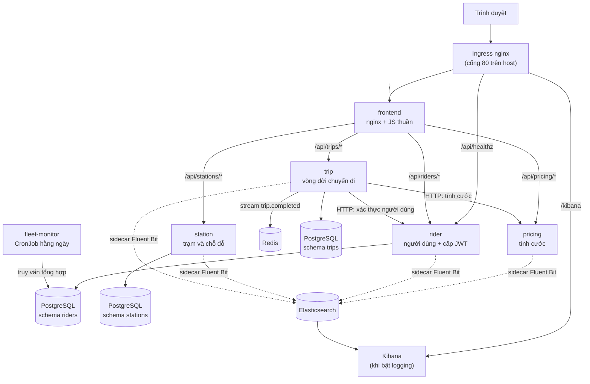

# VeloShare — Nền tảng chia sẻ xe đạp công cộng

Hệ thống chia sẻ xe đạp cho thành phố, xây dựng theo kiến trúc **microservices**, triển khai
trên Kubernetes bằng **cả hai đường: Helm và kubectl/Kustomize**.

> **Đây là dự án thực hành (capstone) để học Kubernetes, không phải hệ thống production.**
> Quy ước phát triển nằm trong [`CLAUDE.md`](./CLAUDE.md).

Tám mục dưới đây bám đúng thứ tự yêu cầu tài liệu tại **§6.2** của
[`capstone-requirements.md`](./capstone-requirements.md).

| # | Mục | |
|---|---|---|
| 1 | [Nghiệp vụ và user story](#1-nghiệp-vụ-và-user-story) | 5 | [Build và triển khai](#5-build-và-triển-khai) |
| 2 | [Danh sách microservice](#2-danh-sách-microservice-và-trách-nhiệm) | 6 | [Kiểm chứng yêu cầu CKAD](#6-kiểm-chứng-từng-yêu-cầu-ckad-bắt-buộc) |
| 3 | [Sơ đồ kiến trúc](#3-sơ-đồ-kiến-trúc) | 7 | [Kịch bản demo 5–10 phút](#7-kịch-bản-demo-510-phút) |
| 4 | [Yêu cầu chuẩn bị](#4-yêu-cầu-chuẩn-bị) | 8 | [Giới hạn đã biết](#8-giới-hạn-đã-biết) |

---

## 1. Nghiệp vụ và user story

**Lĩnh vực:** chia sẻ xe đạp công cộng theo trạm (city bike-share) — một trong các chủ đề gợi ý
tại §2.1 của đề bài.

Người dùng mượn xe tại một trạm, đạp xe, trả xe tại trạm khác, và được tính cước theo **thời
lượng chuyến đi** nhân **đơn giá theo hạng thành viên**, có nhân thêm **hệ số giờ cao điểm**.

**User story chính:**

> *Là một người dùng đã đăng ký, tôi muốn mở khoá một chiếc xe tại trạm gần nhất, đạp tới nơi
> cần đến, trả xe, và biết ngay mình bị tính bao nhiêu tiền — để tôi chủ động được chi phí đi lại
> hằng ngày.*

Các user story phụ:

- *Là quản trị viên, tôi muốn tạo/quản lý người dùng và trạm, cập nhật số chỗ đỗ trống, và xem
  được toàn bộ chuyến đi của mọi người dùng.*
- *Là quản lý, tôi muốn nhận báo cáo chỉ số hằng ngày (số người dùng, số chuyến, doanh thu theo
  hạng) mà không phải tự truy vấn database.*

**Luồng một chuyến đi hoàn chỉnh:**

1. Người dùng đăng nhập → `rider` cấp **JWT** (HS256, hạn 1 giờ).
2. Bấm *Start ride* → `trip` kiểm tra Redis xem người này có đang trong chuyến nào không, gọi
   `rider` xác nhận người dùng tồn tại, ghi bản ghi vào PostgreSQL, đặt key
   `trip:active:{rider_id}` (TTL 7200s).
3. Bấm *End ride* → `trip` tính số phút, gọi `pricing` lấy cước, cập nhật bản ghi, xoá key Redis
   và bắn sự kiện vào Redis stream `trip.completed`.

**Cách tính cước:**

```
cước (cents) = phí mở khoá (100) + số_phút × đơn_giá_theo_hạng × hệ_số_surge
```

| Hạng | Đơn giá/phút | |
|---|---|---|
| `standard` | 15 cents | Khách vãng lai |
| `member` | 8 cents | Thành viên |
| `day_pass` | 5 cents | Vé ngày |

Số phút **làm tròn lên** (chuyến 30 giây vẫn tính 1 phút). Ví dụ: 10 phút, hạng `member`,
surge 1.5 → `100 + 10 × 8 × 1.5 = 220 cents = $2.20`.

---

## 2. Danh sách microservice và trách nhiệm

**5 service lõi** (đúng mức "target 4–5" của §2.2) + 1 frontend + 1 stack logging tuỳ chọn.
Mỗi service có **image riêng**, Dockerfile riêng, và được triển khai độc lập.

| Service | Công nghệ | Trách nhiệm (bounded context) | Trạng thái | Workload |
|---|---|---|---|---|
| `rider` | Python / FastAPI | CRUD người dùng, tra cứu hạng, **cấp JWT** (`/auth/login`) | PostgreSQL schema `riders` | Deployment |
| `station` | Python / FastAPI | Quản lý trạm và số chỗ đỗ | PostgreSQL schema `stations` | Deployment |
| `trip` | Python / FastAPI | Vòng đời chuyến đi, điều phối `rider` + `pricing`, bắn sự kiện | PostgreSQL schema `trips`, Redis | Deployment |
| `pricing` | Python / FastAPI | Tính cước `{phút, hạng, surge} → {cents}` | Không lưu trạng thái | **2 Deployment (blue/green)** + **HPA** |
| `fleet-monitor` | Bash + psql | Báo cáo chỉ số người dùng/doanh thu cho quản lý | Không lưu trạng thái | **CronJob** `0 0 * * *` |
| `frontend` | nginx + JS thuần | Giao diện web, reverse-proxy `/api/*` (cùng origin, không cần CORS) | Không lưu trạng thái | Deployment |
| `pod-lister` | Bash + kubectl API | Lab RBAC: dùng ServiceAccount riêng gọi API liệt kê Pod | Không lưu trạng thái | **CronJob** `*/5 * * * *` |
| `logging` | Elasticsearch + Kibana | Lưu trữ + tra cứu log tập trung (**mặc định TẮT**) | Elasticsearch StatefulSet | StatefulSet + Deployment |

Hạ tầng dùng chung: **PostgreSQL** (StatefulSet + PVC 1Gi) và **Redis** (Deployment).

**Ranh giới dữ liệu — mỗi service một schema và một DB role riêng:**

| Service | Schema | DB role | Ghi chú |
|---|---|---|---|
| `rider` | `riders` | `rider` | `search_path` gán cứng vào schema của mình |
| `station` | `stations` | `station` | không truy vấn chéo schema |
| `trip` | `trips` | `trip` | |
| `fleet-monitor` | *(tất cả)* | `postgres` | **Ngoại lệ có chủ đích**: job báo cáo cần tổng hợp xuyên schema |

**Giao tiếp giữa các service:**

| Kiểu | Cơ chế | Ví dụ |
|---|---|---|
| **Đồng bộ** | HTTP qua DNS nội bộ `http://<svc>.veloshare.svc.cluster.local` | `trip` → `pricing` để tính cước; `trip` → `rider` để xác thực người dùng |
| **Bất đồng bộ** | Redis stream `trip.completed` | `trip` bắn sự kiện khi kết thúc chuyến, không chờ ai xử lý |

Mọi request đều mang một `request_id` (từ header `X-Request-ID` hoặc tự sinh); `trip` chuyển
tiếp sang `rider` và `pricing` nên **tra một `request_id` là thấy toàn bộ giao dịch xuyên service**.

Container ứng dụng nghe cổng **8000**; sidecar `ambassador` (nginx) nghe **8080** và proxy về
`127.0.0.1:8000` — chính 8080 là `targetPort` của ClusterIP Service. Service expose cổng **80**.
Ảnh container dùng tag cố định `veloshare/<tên>:0.1.0` (không bao giờ `:latest`).

---

## 3. Sơ đồ kiến trúc



**Mỗi pod ứng dụng chạy 3 container** (`READY 3/3`):

```
┌─ Pod (rider / station / trip / pricing) ──────────────────┐
│  initContainers:  config-check → migrate                  │
│                                                            │
│  ┌──────────┐   ┌────────────┐   ┌───────────┐            │
│  │ <app>    │   │ ambassador │   │ log-agent │            │
│  │ :8000    │←──│ nginx :8080│   │ Fluent Bit│            │
│  └────┬─────┘   └────────────┘   └─────▲─────┘            │
│       │ ghi JSON                        │ tail             │
│       └──────► emptyDir /var/log/veloshare/app.log ────────┘
└────────────────────────────────────────────────────────────┘
                          ▲ Service targetPort trỏ vào 8080
```

**Cluster:** `kind` 3 node ([`kind-config.yaml`](./kind-config.yaml)) — 1 control-plane
(taint `NoSchedule`, chạy ingress-nginx, map cổng 80/443 của host) + 2 worker chạy toàn bộ pod
ứng dụng.

Sơ đồ chi tiết hơn (luồng dữ liệu, đồng bộ/bất đồng bộ) nằm trong
[`docs/architecture.md`](./docs/architecture.md).

---

## 4. Yêu cầu chuẩn bị

### 4.1 Công cụ

| Công cụ | Vai trò | Kiểm tra |
|---|---|---|
| **Docker** | Build image, chạy node của kind | `docker version` |
| **kind** | Tạo cluster Kubernetes cục bộ | `kind version` |
| **kubectl** | Triển khai, kiểm tra, debug | `kubectl version --client` |
| **Helm v3** | Đường triển khai bằng chart | `helm version` |
| **Kustomize** | Đã tích hợp sẵn trong `kubectl apply -k` | `kubectl kustomize --help` |

### 4.2 Thành phần cần có trong cluster

| Thành phần | Cách cài | Bắt buộc cho |
|---|---|---|
| ingress-nginx | `make ingress` | N2, N3 — truy cập từ ngoài |
| metrics-server | `make metrics-server` | P4 — HPA và `kubectl top` |
| CNI hỗ trợ NetworkPolicy | có sẵn (kindnet) | N4 |
| Default StorageClass | có sẵn (`standard`) | D5 — PVC động |

> `make up` **không** bao gồm `metrics-server`. Chưa cài thì HPA hiển thị `cpu <unknown>`
> và `kubectl top` báo `Metrics API not available`.

### 4.3 Secret phải tự tạo (bắt buộc trước khi triển khai)

**Nguyên tắc: không một credential nào nằm trong git, và Helm cũng không hề nhìn thấy chúng.**
Template chỉ tham chiếu Secret **theo tên** (`envFrom: secretRef`) nên `helm template` render
ra **0 Secret**.

| File local (gitignored) | Secret trong cluster | Pod sử dụng |
|---|---|---|
| `env/postgres.env` | `postgres` | postgres StatefulSet, fleet-monitor |
| `env/rider.env` | `rider-db` | rider |
| `env/station.env` | `station-db` | station |
| `env/trip.env` | `trip-db` | trip |
| `env/auth.env` | `veloshare-auth` | rider (ký JWT) + trip (xác minh) |

```sh
make env-init                 # tạo env/*.env từ *.env.template (không ghi đè)
# → mở từng file, thay TOÀN BỘ giá trị change-me
openssl rand -hex 32          # sinh JWT_SECRET thật
make secrets                  # đẩy từng file thành Secret trong cluster
```

`make secrets` **từ chối chạy** nếu còn sót `change-me`.

**Ba điểm dễ sai:**

- `DB_PASSWORD` trong `env/rider.env` **phải khớp** `RIDER_PASSWORD` trong `env/postgres.env`
  (tương tự station/trip) — script initdb của PostgreSQL dùng giá trị này để tạo LOGIN role.
- `env/postgres.env` **chỉ có tác dụng ở lần initdb đầu tiên**. Đổi mật khẩu sau đó phải
  `ALTER ROLE` hoặc xoá PVC.
- Tài khoản admin (`ADMIN_EMAIL`/`ADMIN_PASSWORD`) lấy từ `veloshare-auth`, **không** nằm trong
  bảng `riders` — không ai tạo được tài khoản admin qua API.

---

## 5. Build và triển khai

### 5.1 Dựng toàn bộ trong một lệnh

```sh
make env-init                 # lần đầu: tạo env/*.env rồi sửa hết change-me
make up                       # cluster → ingress → secrets → build → load → deploy (Helm)
make metrics-server           # cần cho HPA (P4) và kubectl top
```

Hoặc từng bước:

```sh
make cluster-up               # tạo cluster kind 3 node
make ingress                  # cài ingress-nginx và chờ sẵn sàng
make secrets                  # đẩy env/*.env thành Secret
./scripts/build.sh            # build + kind load toàn bộ image (= make images && make load)
make deploy                   # helm upgrade --install
```

### 5.2 Hai đường triển khai — chọn MỘT

Cả hai mô tả cùng một hệ thống: thư mục `k8s/` được **sinh tự động từ chart** bằng
`scripts/gen-k8s.sh`, nên hai đường không thể lệch nhau.

```sh
# Đường A — Helm (mặc định)
./scripts/deploy.sh helm

# Đường B — kubectl / Kustomize
./scripts/deploy.sh kubectl dev      # overlay dev  (1 replica mỗi service)
./scripts/deploy.sh kubectl prod     # overlay prod (2 replica + quota cao hơn)
```

> **Không bao giờ chạy cả hai cùng lúc.** Helm và kubectl đều tin rằng mình sở hữu các object
> nó tạo ra: cài chart đè lên bản apply thô sẽ khiến Helm "nhận vơ" tài nguyên nó không tạo,
> còn apply `k8s/` đè lên một release sẽ bị `helm upgrade` kế tiếp ghi đè ngược lại — cả hai
> đều hỏng âm thầm. `scripts/deploy.sh` **tự chặn** đường này khi đường kia đang giữ namespace
> (bỏ qua bằng `FORCE=1` nếu bạn thực sự muốn).

Gỡ đường đang dùng trước khi đổi sang đường kia:

```sh
helm uninstall veloshare -n veloshare     # nếu đang dùng Helm
kubectl delete -k k8s/overlays/dev        # nếu đang dùng kubectl
```

### 5.3 Sau khi sửa code một service

Tag image **không đổi** (`0.1.0`) nên Kubernetes không tự nhận ra bản build mới:

```sh
./scripts/build.sh rider                       # build lại + nạp vào kind, chỉ service này
kubectl -n veloshare rollout restart deploy/rider
kubectl -n veloshare rollout status deploy/rider
```

### 5.3b Tag thứ hai của `pricing` (phục vụ blue/green và pin image theo môi trường)

`pricing` tồn tại ở **hai tag** trong cluster, và hai thứ phụ thuộc vào điều đó:

- **blue/green**: `pricing-blue` chạy `0.1.0`, `pricing-green` chạy `0.2.0` (xem §5.3c)
- **overlay**: `dev` pin màu đang chạy ở `0.1.0`, `prod` pin ở `0.2.0`

Vì vậy `make images` / `make load` (và do đó cả `make up`) đã build+nạp sẵn cả hai tag:

```sh
make images                    # 7 image ở 0.1.0, cộng pricing:0.2.0
docker images | grep veloshare/pricing        # thấy cả 0.1.0 và 0.2.0
make images-demo-tag           # chỉ build lại riêng tag 0.2.0 khi cần
```

Giá trị version được **nướng vào image lúc build** (`ARG APP_VERSION` trong
[`services/pricing/Dockerfile`](./services/pricing/Dockerfile), `scripts/build.sh` truyền
`--build-arg APP_VERSION=$TAG`), nên pod **không thể báo sai** image nó đang chạy:

```sh
kubectl -n veloshare exec deploy/pricing-blue  -c ambassador -- curl -s 127.0.0.1:8080/version
# {"service":"pricing","version":"0.1.0"}
kubectl -n veloshare exec deploy/pricing-green -c ambassador -- curl -s 127.0.0.1:8080/version
# {"service":"pricing","version":"0.2.0"}
```

### 5.3c Blue/green trên service `pricing`

`pricing` chạy **hai Deployment cùng lúc** — `pricing-blue` và `pricing-green` — sinh ra từ
đúng một thân template ([`charts/pricing/templates/deployment.yaml`](./helm/veloshare/charts/pricing/templates/deployment.yaml)).
Cả hai mang nhãn `app.kubernetes.io/name: pricing` (nên NetworkPolicy, Ingress và tên DNS
`pricing` khớp với cả hai), chỉ khác nhau ở nhãn `color` — và `color` cũng nằm trong
`selector.matchLabels` của từng Deployment nên hai ReplicaSet không bao giờ giành Pod của nhau.

Service `pricing` chọn **một màu** tại một thời điểm. Chuyển traffic = patch đúng một dòng
selector: tên Service, ClusterIP và DNS giữ nguyên, **không Deployment nào bị đụng tới**.

```sh
make bluegreen-status     # màu nào đang phục vụ, image/version của từng màu
make bluegreen            # blue -> green, in bằng chứng trước/sau
make bluegreen-rollback   # green -> blue
```

Bằng tay:

```sh
curl -s localhost/api/pricing/version         # {"service":"pricing","version":"0.1.0"}
kubectl -n veloshare patch svc pricing -p '{"spec":{"selector":{"color":"green"}}}'
curl -s localhost/api/pricing/version         # {"service":"pricing","version":"0.2.0"}
kubectl -n veloshare get pods -l app.kubernetes.io/name=pricing   # vẫn đúng 2 Pod đó, cùng AGE
```

> Patch bằng `kubectl` chỉ có hiệu lực **tới lần `make deploy` kế tiếp** — Helm sẽ đặt lại
> selector theo `values.yaml`. Muốn giữ green làm mặc định:
> `helm upgrade veloshare ./helm/veloshare -n veloshare --set pricing.blueGreen.activeColor=green`.
> HPA cũng bám theo `activeColor`.

> `/healthz` **cố ý giữ nguyên** `{"status":"ok"}` — probe và `scripts/smoke-test.sh` so khớp
> chính xác chuỗi này, nên version được đưa ra endpoint `/version` riêng.

### 5.4 Sau khi sửa Helm chart

```sh
make lint && make template          # kiểm tra trước khi chạm cluster
make deploy                         # helm upgrade --install
make gen-k8s                        # sinh lại k8s/ để hai đường không lệch nhau
```

### 5.5 Truy cập

| Địa chỉ | Nội dung |
|---|---|
| <http://localhost/> | Giao diện VeloShare (đăng nhập) |
| <http://localhost/api/healthz> | Health check của `rider` qua Ingress |
| <http://localhost/kibana> | Kibana (chỉ khi bật `global.logging.enabled`) |

```sh
make seed              # tạo sẵn trạm/người dùng/chuyến đi mẫu
make smoke-test        # 22 kiểm tra E2E, exit != 0 nếu có lỗi
```

---

## 6. Kiểm chứng từng yêu cầu CKAD bắt buộc

Bảng đầy đủ (yêu cầu → file cài đặt → lệnh kiểm chứng) nằm trong
[`docs/ckad-checklist.md`](./docs/ckad-checklist.md). Dưới đây là lệnh ngắn nhất cho từng mục
**Required** của §4.

### 4.1 Application Design and Build

| ID | Kiểm chứng |
|---|---|
| D1 | `ls services/*/Dockerfile` → 7 Dockerfile; `docker images \| grep veloshare` → tag `0.1.0`, không có `:latest` |
| D2 | `kubectl -n veloshare get deploy,sts,cronjob` → 7 Deployment (`pricing` là hai màu blue/green), 1 StatefulSet, 2 CronJob |
| D3 | `kubectl -n veloshare get pod -l app.kubernetes.io/name=rider -o jsonpath='{.items[0].spec.initContainers[*].name} {.items[0].spec.containers[*].name}'` → `config-check migrate rider ambassador log-agent` |
| D4 | `kubectl -n veloshare exec deploy/rider -c rider -- ls /var/log/veloshare` rồi `kubectl -n veloshare logs deploy/rider -c log-agent` → cùng dòng log qua `emptyDir` dùng chung |
| D5 | `kubectl -n veloshare get pvc` → `data-postgres-0` + `fleet-monitor-reports` đều `Bound` |
| D6 | `kubectl -n veloshare get pods --show-labels -l app.kubernetes.io/name=pricing` → hai Pod cùng `name=pricing`, khác `color`; `kubectl -n veloshare get svc pricing -o jsonpath='{.spec.selector}'` → selector đang trỏ màu nào |

### 4.2 Application Deployment

| ID | Kiểm chứng |
|---|---|
| P1 | `kubectl -n veloshare get deploy` → 7 Deployment, đều `READY 1/1` trở lên |
| P2 | `kubectl -n veloshare rollout restart deploy/pricing-blue && kubectl -n veloshare rollout status deploy/pricing-blue` |
| P3 | Blue/green **trên chính service `pricing`**: `make bluegreen-status` → hai Deployment `pricing-blue` (0.1.0) / `pricing-green` (0.2.0); `make bluegreen` → patch selector của Service, `curl -s localhost/api/pricing/version` đổi từ `0.1.0` sang `0.2.0` mà **không Pod nào bị thay**; `make bluegreen-rollback` để quay lại |
| P4 | `kubectl -n veloshare get hpa` → `cpu: N%/70%` (không phải `<unknown>`) |
| P5 | `diff <(kubectl kustomize k8s/overlays/dev) <(kubectl kustomize k8s/overlays/prod)` → khác **image tag** của màu đang chạy (`pricing-blue`: `0.1.0` vs `0.2.0`), **replicas** (1 vs 2) và **ResourceQuota**. Chứng minh pod đang chạy image nào: `kubectl -n veloshare exec deploy/pricing-blue -c ambassador -- curl -s 127.0.0.1:8080/version` |
| P6 | `helm -n veloshare history veloshare` rồi `make rollback REV=1` |

### 4.3 Application Environment, Configuration & Security

| ID | Kiểm chứng |
|---|---|
| C1 | `kubectl -n veloshare get cm` → 11 ConfigMap; inject qua `envFrom.configMapRef` |
| C2 | `kubectl -n veloshare get secret` → 5 Secret; `helm template ... \| grep -c '^kind: Secret'` → **0** |
| C3 | `kubectl -n veloshare get deploy rider -o jsonpath='{.spec.template.spec.containers[0].securityContext}'` → `runAsNonRoot`, `allowPrivilegeEscalation:false`, `drop:[ALL]`, `readOnlyRootFilesystem:true` |
| C4 | `kubectl -n veloshare get sa,role,rolebinding` → `pod-lister`; `kubectl -n veloshare create job pods-now --from=cronjob/pod-lister` rồi xem log |
| C5 | `kubectl -n veloshare get resourcequota,limitrange` → `veloshare-quota` + `veloshare-limits` |
| C6 | `kubectl -n veloshare get pods -o jsonpath='{range .items[*]}{range .spec.containers[*]}{.name}{" "}{.resources}{"\n"}{end}{end}'` → mọi container đều có requests + limits |

### 4.4 Services and Networking

| ID | Kiểm chứng |
|---|---|
| N1 | `kubectl -n veloshare get svc` → ClusterIP cho toàn bộ traffic nội bộ |
| N2 | `curl -s -o /dev/null -w '%{http_code}' http://localhost/` → `200` (Ingress); `frontend` còn có NodePort |
| N3 | `kubectl -n veloshare get ingress` → 2 Ingress, 3 path rule (`/`, `/kibana`, `/api/healthz`) tới 2+ backend |
| N4 | `kubectl -n veloshare get netpol` → **8 policy**: `default-deny` (podSelector rỗng, chặn cả hai chiều cho MỌI Pod) + 7 policy cho phép có phạm vi. `kubectl -n veloshare get netpol default-deny -o jsonpath='{.spec}'` → không có một rule nào. Chứng minh cấm/cho phép: `make demo` bước 7 |
| N5 | `kubectl -n veloshare get endpointslices` → mọi Service đều có endpoint, không có `<none>` |

### 4.5 Application Observability and Maintenance

| ID | Kiểm chứng |
|---|---|
| O1/O2 | `kubectl -n veloshare get deploy rider -o jsonpath='{.spec.template.spec.containers[0].livenessProbe}{"\n"}{.spec.template.spec.containers[0].readinessProbe}'` |
| O3 | `helm template veloshare ./helm/veloshare \| grep -c startupProbe` → **6** ngay ở cấu hình mặc định (5 workload; `pricing` render hai lần, mỗi màu một bản): `rider`/`station`/`trip`/`pricing` (HTTP `/healthz`, 2s × 30 = 60s) và `postgres` (`pg_isready`, 3s × 40 = 120s, vì lần khởi động đầu phải chạy `initdb` + `init.sql`). Bật logging thêm elasticsearch/kibana thành 8. `frontend`/`redis` cố ý không có: cả hai lắng nghe dưới 1 giây. Lab độc lập: `k8s/labs/probes-demo.yaml` |
| O4 | Xem [§8](#8-giới-hạn-đã-biết) và bảng lệnh debug ngay dưới đây |
| O5 | `grep -rh '^apiVersion' k8s/ \| sort -u` → chỉ có API ổn định: `v1`, `apps/v1`, `batch/v1`, `autoscaling/v2`, `networking.k8s.io/v1`, `rbac.authorization.k8s.io/v1` (cộng `kustomize.config.k8s.io/v1beta1` của chính file kustomization, không phải API của cluster). Không có `extensions/v1beta1` hay `autoscaling/v2beta*` |

### Lệnh debug (O4)

```sh
kubectl -n veloshare get pods -o wide                 # trạng thái tổng quan
kubectl -n veloshare describe pod <pod>               # Events ở cuối giải thích hầu hết lỗi
kubectl -n veloshare get events --sort-by=.lastTimestamp
kubectl -n veloshare get svc,endpointslices           # Service không có endpoint = sai selector
kubectl -n veloshare top pods                         # cần metrics-server
kubectl -n veloshare logs deploy/<svc> -c <svc>       # pod có 3 container nên BẮT BUỘC có -c
kubectl -n veloshare logs deploy/<svc> -c log-agent   # log JSON qua sidecar Fluent Bit
kubectl -n veloshare exec postgres-0 -- psql -U postgres -d veloshare -c '\dt trips.*'
kubectl -n veloshare exec deploy/redis -- redis-cli XRANGE trip.completed - +
```

**Xuất trạng thái thật ra file để đọc/nộp:**

```sh
make evidence          # ghi docs/evidence/*.yaml (chỉ đọc, bỏ qua mọi bước phá huỷ)
```

Secret **không bao giờ** được xuất dạng YAML — chỉ có output `kubectl describe secret`
(tên key + số byte, không có giá trị) ghi ra `docs/evidence/secret-*.txt`.

---

## 7. Kịch bản demo 5–10 phút

Chạy có hướng dẫn, dừng chờ Enter giữa các bước:

```sh
make demo                  # cả 9 bước
./scripts/demo.sh 7        # chỉ bước 7 (NetworkPolicy)
./scripts/demo.sh --no-pause
```

Mỗi bước trình bày **ba phần** để người chấm lần được từ mã nguồn tới cluster đang chạy:

| Phần | Nội dung |
|---|---|
| `MANIFEST` | Tài nguyên được **khai báo** ở đâu — đường dẫn file, số dòng thật, trích đoạn in kèm |
| `LIVE` | Lệnh **chính xác** (in kèm tiền tố `$ `) và output nguyên văn từ cluster |
| `EXPORT` | Object đang chạy ghi ra `docs/evidence/*.yaml` |

| Bước | Nội dung | Yêu cầu CKAD |
|---|---|---|
| 1 | Pod đều Running/Ready; Service đều có endpoint | N5, P1, O1, O2 |
| 2 | Ingress định tuyến `/` và `/api/healthz` | N2, N3, O5 |
| 3 | Inject ConfigMap/Secret; chart render 0 Secret | C1, C2 |
| 4 | Probe: xoá pod `rider`, endpoint rớt rồi quay lại khi readiness pass | O1, O2, O3 |
| 5 | Rolling update trên `pricing-blue`, rồi đảo blue/green **trên chính Service `pricing`** bằng một lệnh patch selector — `/version` đổi từ `0.1.0` sang `0.2.0` mà không Pod nào bị thay | P2, P3, D6 |
| 6 | HPA đang tính được metric thật | P4 |
| 7 | NetworkPolicy: cùng image, cùng URL, **chỉ khác label** → một bên timeout, một bên 200 | N4 |
| 8 | Ghi dữ liệu → xoá `postgres-0` → đọc lại từ cùng PVC | D5 |
| 9 | `helm history` + rollback; `diff` hai overlay Kustomize | P5, P6 |

Các bước thay đổi trạng thái cluster (4, 5, 8, 9) **luôn hỏi xác nhận** và tự khôi phục trạng
thái ban đầu sau khi chạy.

---

## 8. Giới hạn đã biết

**Về triển khai**

- **Helm và `k8s/` là hai đường thay thế nhau, không phải hai lớp.** Chạy đồng thời sẽ dẫn tới
  hai chủ sở hữu cho cùng một object. `scripts/deploy.sh` chặn sẵn, nhưng `kubectl apply -k`
  gọi trực tiếp thì không có gì chặn.
- `k8s/` **được sinh ra** từ `helm/veloshare`. Sửa tay trong `k8s/base/` sẽ bị `make gen-k8s`
  ghi đè — sửa chart rồi sinh lại.
- Chỉ **`pricing`** được build ở hai tag (`0.1.0` cho `pricing-blue` / overlay `dev`, `0.2.0`
  cho `pricing-green` / overlay `prod`). Sáu service còn lại chỉ tồn tại đúng một tag `0.1.0`
  trong cluster kind nên **không** được pin trong overlay — pin một tag chưa từng nạp sẽ render
  ra manifest không kéo được image. Tag `0.2.0` build từ **cùng một source**, chỉ khác giá trị
  `APP_VERSION` nướng vào lúc build, nên không có khác biệt hành vi ngoài `GET /version`. Nghĩa
  là blue/green ở đây chứng minh **cơ chế cắt traffic**, không phải một thay đổi nghiệp vụ.
- **`pricing-green` luôn chạy**, kể cả khi không ai đảo màu. Đó là bản chất của blue/green
  (phải có sẵn đích ấm để cắt sang) chứ không phải Pod thừa — nhưng nó tốn thêm 45m CPU /
  176Mi requests và đã được tính vào `ResourceQuota`.
- **Lab độc lập `k8s/labs/bluegreen-demo.yaml` giờ đã thừa** so với blue/green thật ở trên;
  giữ lại chỉ để thực hành trên cặp nginx dùng một lần. Pod `kubectl run` curl của nó bị
  `default-deny` NetworkPolicy chặn — chạy với `--set global.networkPolicy.enabled=false`
  hoặc đọc màu trực tiếp từ Service.

**Về vận hành**

- **metrics-server không nằm trong `make up`** — phải chạy `make metrics-server`, nếu không HPA
  hiển thị `cpu <unknown>` và `kubectl top` báo lỗi.
- **Elasticsearch + Kibana mặc định TẮT** (`global.logging.enabled: false`) vì thêm ~350m CPU /
  400Mi vào requests, vượt `ResourceQuota` của namespace. Bật thì phải nâng quota cùng lúc —
  xem ví dụ `--set` trong [`helm/veloshare/values.yaml`](./helm/veloshare/values.yaml).
  Sidecar Fluent Bit và `emptyDir` dùng chung vẫn hoạt động khi tắt, chỉ đổi đích xuất log.
- `fleet-monitor` là **tên gọi lệch nghĩa**: trước đây nó poll `/healthz` mỗi 5 phút, nay đã đổi
  thành job báo cáo hằng ngày; tên giữ nguyên để không phải sửa toàn bộ umbrella chart.
- Báo cáo của `fleet-monitor` chỉ in ra **log của Job**. Gửi email/Slack cần thêm Secret
  SMTP/webhook — ngoài phạm vi môi trường học tập cục bộ.

**Về bảo mật — đây là môi trường học tập, không phải chuẩn mực production**

- **`default-deny` NetworkPolicy phủ toàn namespace** (`podSelector: {}`), nên **mọi Pod tự
  apply vào `veloshare` đều không có mạng** cho tới khi có policy gọi tên nó. Đó là chủ đích,
  không phải lỗi — nhưng nhớ điều này khi chạy các lab trong `k8s/labs/`. Tắt cả bộ bằng
  `--set global.networkPolicy.enabled=false`, hoặc dùng namespace `veloshare-lab` (`make lab`).
- `pod-lister-api-egress` buộc phải dùng `ipBlock: 0.0.0.0/0` (giới hạn ở cổng 443/6443) vì
  kube-proxy DNAT `kubernetes.default.svc` về **IP của node**, không podSelector nào khớp được.
  Đây là đánh đổi có ý thức, giải thích ngay trong file policy.

- Elasticsearch chạy `xpack.security.enabled=false`; toàn bộ giao tiếp là **HTTP thuần, không TLS**.
- Secret chỉ được **base64 trong etcd**, không mã hoá. Môi trường thật nên dùng
  Sealed Secrets / External Secrets / Vault và bật encryption-at-rest.
- `env/*.env` nằm trên đĩa local ở dạng plaintext (đã được `.gitignore` chặn).

**Về dữ liệu**

- Redis **không bền vững** (không AOF/RDB): mất pod là mất `trip:active:*` và stream
  `trip.completed`. Bản ghi chuyến đi luôn nằm trong PostgreSQL nên không mất dữ liệu nghiệp vụ.
- PostgreSQL chạy **một replica**, không có replica đọc và không có backup tự động. Overlay
  `prod` cố ý **không** tăng replica cho postgres/redis: một StatefulSet với PVC RWO không tự
  trở thành HA chỉ vì tăng số replica.
- Chưa có test tự động cho code Python. Kiểm chứng dựa vào `helm lint` / `helm template` cho
  chart và `make smoke-test` cho hệ thống đang chạy.

---

## Tài liệu chi tiết

| Tài liệu | Dành cho |
|---|---|
| [`docs/USER_GUIDE.md`](./docs/USER_GUIDE.md) | Người dùng cuối — đăng nhập, tìm trạm, đi xe, xem cước |
| [`docs/ADMIN_GUIDE.md`](./docs/ADMIN_GUIDE.md) | Quản trị viên — vận hành, rolling update, rollback, xử lý sự cố |
| [`docs/architecture.md`](./docs/architecture.md) | Sơ đồ service, luồng dữ liệu, đồng bộ/bất đồng bộ |
| [`docs/ckad-checklist.md`](./docs/ckad-checklist.md) | **Bản đồ yêu cầu CKAD → file + lệnh kiểm chứng** (dành cho người chấm) |
| [`CLAUDE.md`](./CLAUDE.md) | Quy ước phát triển của dự án |

### Cấu trúc thư mục

```
services/<svc>/          Mã nguồn + Dockerfile của từng service (7 service)
helm/veloshare/          Umbrella chart, 9 subchart phụ thuộc  ─┐
k8s/                     Manifest thô — SINH RA từ chart        ─┴─ hai đường thay thế nhau
  base/                    Namespace, ConfigMap, Service, Deployment, StatefulSet, CronJob, HPA
  overlays/dev|prod/       Kustomize overlay (replicas + ResourceQuota)
  network/                 Ingress + NetworkPolicy
  security/                ServiceAccount + Role + RoleBinding
  quota/                   ResourceQuota + LimitRange
  storage/                 PersistentVolumeClaim
  labs/                    Lab độc lập: blue/green, PVC, probes, kustomize-demo
env/                     Cấu hình + credential từng pod (*.env gitignored, chỉ commit *.env.template)
scripts/                 build.sh, deploy.sh, gen-k8s.sh, demo.sh, smoke-test.sh, seed-data.sh, apply-secrets.sh
docs/                    Tài liệu + evidence/ (trạng thái cluster xuất ra bằng `make evidence`)
kind-config.yaml         Định nghĩa cluster kind 3 node
Makefile                 Các lệnh vận hành
```
