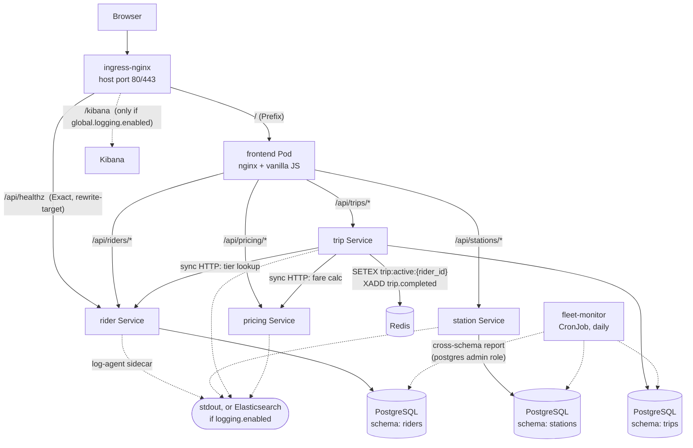
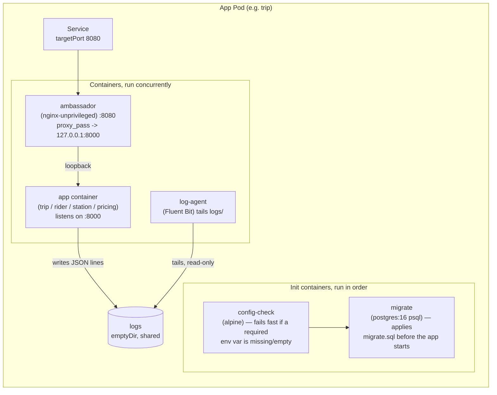
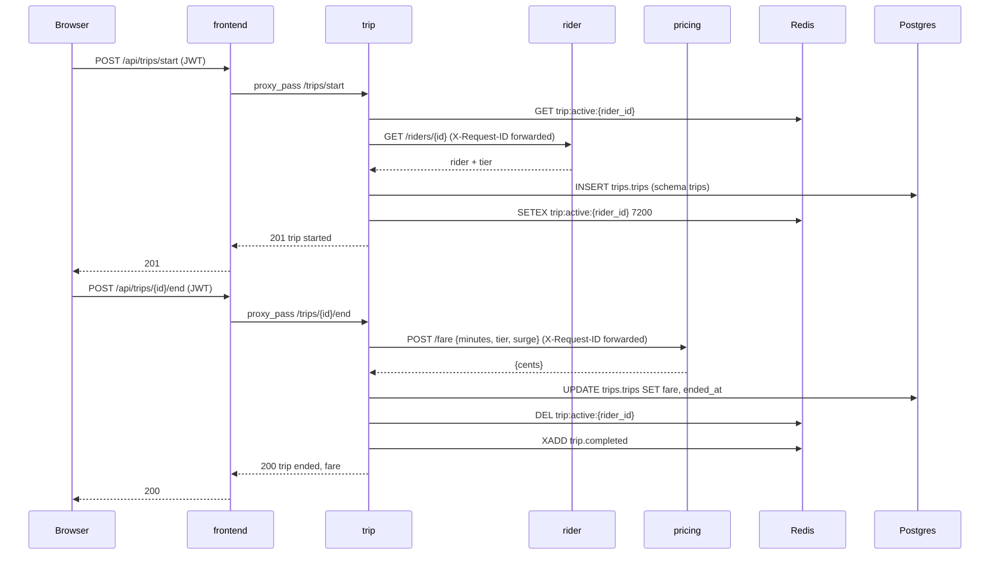

# VeloShare — Architecture

This document is the technical companion to [`README.md`](../README.md): the service diagram,
data flow, and — per the project's microservices standards — an explicit description of which
service-to-service calls are synchronous and which are asynchronous. Operator commands live in
[`ADMIN_GUIDE.md`](./ADMIN_GUIDE.md); end-user flows in [`USER_GUIDE.md`](./USER_GUIDE.md).

## Table of contents

- [Services and bounded contexts](#services-and-bounded-contexts)
- [Service diagram](#service-diagram)
- [Pod composition](#pod-composition)
- [Sync communication](#sync-communication)
- [Async communication](#async-communication)
- [A complete trip, step by step](#a-complete-trip-step-by-step)
- [Data ownership](#data-ownership)
- [Request tracing](#request-tracing)
- [North-south traffic (ingress)](#north-south-traffic-ingress)
- [East-west traffic (NetworkPolicy)](#east-west-traffic-networkpolicy)

## Services and bounded contexts

Five app services plus a static frontend, each with a single bounded context. No service reaches
into another's database — the only communication paths are the ones documented below.

| Service | Bounded context | Talks to |
|---|---|---|
| `rider` | Rider identity: CRUD, tier lookup, **JWT issuance** (`/auth/login`, `/auth/me`) | Postgres schema `riders` |
| `station` | Station & dock inventory | Postgres schema `stations` |
| `trip` | Trip lifecycle (start/end), fare orchestration, event publishing | `rider` (sync), `pricing` (sync), Redis, Postgres schema `trips` |
| `pricing` | Fare calculation `{minutes, tier, surge} -> {cents}` | Stateless — no calls out, no data store |
| `fleet-monitor` | Daily cross-service metrics report (CronJob) | Postgres, all three schemas (documented exception, see below) |
| `frontend` | Static dashboard + same-origin `/api/*` reverse proxy | `pricing`, `rider`, `station`, `trip` (proxied, not called directly by the browser) |

Updating one service's code only requires rebuilding and reloading that service's image — no
shared library, no shared runtime, no cross-service redeploy.

## Service diagram

Each `*_SVC` node is a ClusterIP Service that actually points at that Pod's **ambassador**
sidecar, not the app container directly — see [Pod composition](#pod-composition).

## Pod composition

Every one of the four backend app Pods (`rider`, `station`, `trip`, `pricing`) is **3
containers + 2 init containers**, all rendered from the shared helpers in
[`helm/veloshare/templates/_helpers.tpl`](../helm/veloshare/templates/_helpers.tpl) so the
pattern is identical across services:

- **`config-check`** (init) — CKAD init-container demo: reads the same Secrets/ConfigMaps the app
  container will use (via `envFrom`) and exits non-zero if a required variable is unset, before
  anything else in the Pod starts. Mirrors each service's own `require_env()` at the Python level.
- **`migrate`** (init) — runs that service's `migrate.sql` (from a ConfigMap) against Postgres with
  `psql`, so schema changes land before the app container can serve traffic.
- **`ambassador`** (sidecar) — a local `nginx-unprivileged` reverse proxy. The Service's
  `targetPort` is the ambassador's port (`8080`), not the app's `containerPort` (`8000`); the
  ambassador `proxy_pass`es to the app over `127.0.0.1` inside the same network namespace. The
  app itself is unaware of it. Toggle per service via `<svc>.ambassador.enabled`.
- **`log-agent`** (sidecar) — Fluent Bit, tails the shared `logs` `emptyDir` (`/var/log/veloshare/app.log`,
  read-write for the app, read-only here) and ships to stdout, or to Elasticsearch when
  `global.logging.enabled=true`.

`postgres` (StatefulSet + PVC) and `redis` (Deployment) are plain single-container Pods —
the multi-container pattern only applies to the four app services above; `frontend` also carries
a `log-agent` sidecar but has no ambassador (its own nginx already listens on the Service port)
and no migrate/config-check init containers (it is stateless and has nothing to migrate).

## Sync communication

All service-to-service calls are **HTTP/JSON over in-cluster DNS**
(`http://<service>.veloshare.svc.cluster.local`, or the short name `http://<service>` within the
namespace) — there is no gRPC and no service mesh.

- `trip` -> `rider`: `GET /riders/{id}` — confirms the rider exists and fetches their tier before
  starting or pricing a trip. URL from `RIDER_URL` (default
  `http://rider.veloshare.svc.cluster.local`).
- `trip` -> `pricing`: `POST /fare` `{minutes, tier, surge}` -> `{cents}` — called when a trip
  ends. URL from `PRICING_URL` (default `http://pricing.veloshare.svc.cluster.local`).
- `frontend` -> `pricing`/`rider`/`station`/`trip`: the browser only ever calls the frontend's own
  origin; frontend's nginx (`services/frontend/nginx.conf`) reverse-proxies `/api/pricing/*`,
  `/api/riders/*`, `/api/stations/*`, `/api/trips/*` to the matching backend Service. Same-origin
  from the browser's point of view, so there is no CORS to configure.
- Every synchronous call is a **request/response** — the caller blocks and the trip's HTTP
  response to the browser is not sent until `rider`/`pricing` have replied (or timed out; `trip`'s
  `httpx.AsyncClient` uses a 5s timeout).

`pricing` never calls anything — it is purely stateless request/response, which is also why it is
the only backend service with an *optional* init container demonstrating the opposite pattern (see
`pricing.initCheck` in `helm/veloshare/charts/pricing/values.yaml` — it waits on `rider` and
Postgres even though `pricing` itself needs neither, purely to show the wait-for-dependency
pattern; toggle with `pricing.initCheck.enabled`).

## Async communication

Redis is VeloShare's only asynchronous channel, and it is deliberately **non-durable** — it is
never the system of record for a trip.

- **`trip:active:{rider_id}`** — a key with a TTL (`ACTIVE_TTL_SECONDS`, default 7200s), set when
  a trip starts and deleted when it ends. `trip` checks this key before starting a new trip so one
  rider cannot hold two bikes at once. This is a fast existence check, not a queue.
- **`trip.completed`** stream — `trip` `XADD`s an event to this stream when a trip ends
  (fan-out, fire-and-forget: `trip` does not wait for or care whether anything is currently
  reading the stream). No other VeloShare service currently consumes it; it exists as the
  extension point for anything that wants to react to completed trips (billing exports,
  notifications, analytics) without `trip` knowing about the consumer. Inspect it directly:
  `kubectl -n veloshare exec deploy/redis -- redis-cli XRANGE trip.completed - +`.

Because Redis is non-durable, **the trip record itself always lives in Postgres** — losing Redis
loses the "already riding?" fast-path and the completed-trip fan-out, never the trip history.

## A complete trip, step by step

## Data ownership

One shared PostgreSQL StatefulSet, but **one schema and one DB role per service**, each role's
`search_path` pinned to only its own schema at role-creation time — application code cannot query
across schemas even if it tried, because the role it authenticates as has no visibility outside
its own.

| Service | Schema | DB role | Credentials Secret |
|---|---|---|---|
| `rider` | `riders` | `rider` | `rider-db` |
| `station` | `stations` | `station` | `station-db` |
| `trip` | `trips` | `trip` | `trip-db` |

**Documented exception:** `fleet-monitor` authenticates as the `postgres` admin role (from the
`postgres` Secret) specifically to aggregate riders + stations + trips into one daily report —
this is the one place in the codebase that deliberately crosses schema boundaries, and it is
legitimate because a reporting job's whole job is to see the aggregate picture; it never writes.

Redis is shared across `trip` only (no other service touches it) and is not schema-partitioned —
it holds no durable data, so partitioning it is unnecessary.

## Request tracing

Every inbound request gets a `request_id`: taken from the `X-Request-ID` header if the caller
supplied one, generated (`uuid4().hex`) otherwise. `trip` is the one service that fans a single
user action out into further HTTP calls, so it forwards its own `X-Request-ID` to both `rider`
and `pricing` on those calls. The result: one `request_id` ties together `trip`'s `trip_completed`
log event and `pricing`'s `fare_computed` log event for the exact same fare calculation, even
though they're two different Pods. Every response also carries `x-request-id` back to the caller.
See `docs/ADMIN_GUIDE.md`'s [Logging with Kibana](./ADMIN_GUIDE.md#logging-with-kibana) section for
how to query this once Elasticsearch/Kibana are enabled — with `global.logging.enabled=false`
(the current default), the same correlation is doable with
`kubectl -n veloshare logs deploy/<service> -c log-agent | grep '"request_id": "<id>"'` across
services.

## North-south traffic (ingress)

Two `Ingress` objects, both conditional on `global.ingress.enabled`:

| Ingress object | Path | Backend | Notes |
|---|---|---|---|
| `veloshare` | `/` (Prefix) | `frontend:80` | Serves the dashboard; the browser's only entry point for the app UI and, via frontend's own reverse proxy, the API |
| `veloshare` | `/kibana` (Prefix) | `kibana:5601` | Only rendered when `global.logging.enabled=true` |
| `veloshare-api` | `/api/healthz` (Exact) | `rider:80` | `nginx.ingress.kubernetes.io/rewrite-target: /healthz` — a CKAD demo of ingress-level path rewriting, routed straight to `rider`'s Service (via its ambassador), bypassing frontend entirely |

`global.ingress.host` is empty, so both objects are host-less and match any `Host` header —
`http://localhost/` works with no `/etc/hosts` entry. `/api/healthz` is intentionally kept as a
single literal path in its own Ingress object (see the comment in
`helm/veloshare/templates/ingress-api.yaml`): an earlier version matched the whole `/api` prefix
and silently hijacked frontend's own `/api/*` proxy routes (including login), because
ingress-nginx evaluates a regex/exact path with higher precedence than the plain `/` prefix rule.

## East-west traffic (NetworkPolicy)

`backend-isolation` (`helm/veloshare/templates/networkpolicy-backend.yaml`, gated by
`global.networkPolicy.enabled`) restricts who may reach `rider`/`station`/`trip`/`pricing`:

- **Ingress allowed from:** the ingress-nginx controller's namespace (needed for
  `/api/healthz`), the `frontend` Pod, and the other three backend Pods (needed for `trip`'s
  direct calls to `rider` and `pricing`) — on ports `8080` (ambassador) and `8000` (app).
- **Egress allowed to:** kube-dns, Postgres, Redis, the other backend Pods, and (only when
  `global.logging.enabled=true`) Elasticsearch. Everything else — including the open internet —
  is denied by NetworkPolicy's default-deny-once-selected behavior.

This is enforced on this cluster: kindnet (kind's default CNI) does implement NetworkPolicy here,
confirmed by a real 504 from `/api/healthz` when the policy was briefly (and mistakenly) assumed
inert. A Pod outside the allow-list gets no response from a backend Service at all; see the
`kubectl run probe ...` command in the NetworkPolicy manifest's comments for a live demonstration.
